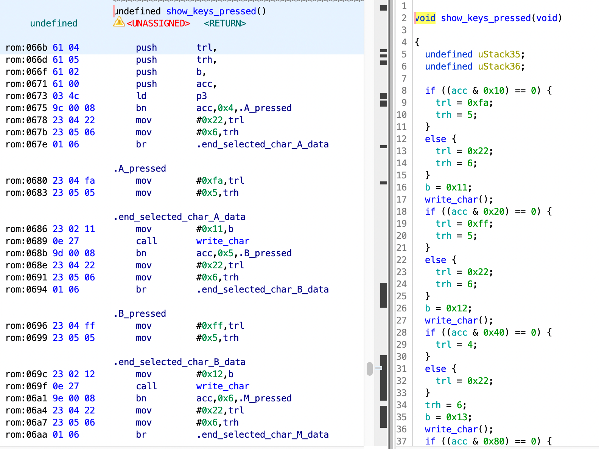

#  Ghidra-VMU-Processor
Ghidra Processor for disassembling/"decompiling" Dreamcast VMU binaries

## Using

Currently this only works with raw `.vms` binaries.

Copy the `LC8670` folder into the `$(GHIDRA_ROOT)/Ghidra/Processors/` directory; where `$(GHIDRA_ROOT)` is the location of your Ghidra installation. You will probably need to restart Ghidra to have the `LC8670` option appear when selecting the language option when importing a binary.

## Credits
Marcus Comstedt - [Dreamcast Programming](http://mc.pp.se/dc/)
Dmitry Grinberg - [VMU Hackery 2017](https://dmitry.gr/?r=05.Projects&proj=25.%20VMU%20Hacking)
 